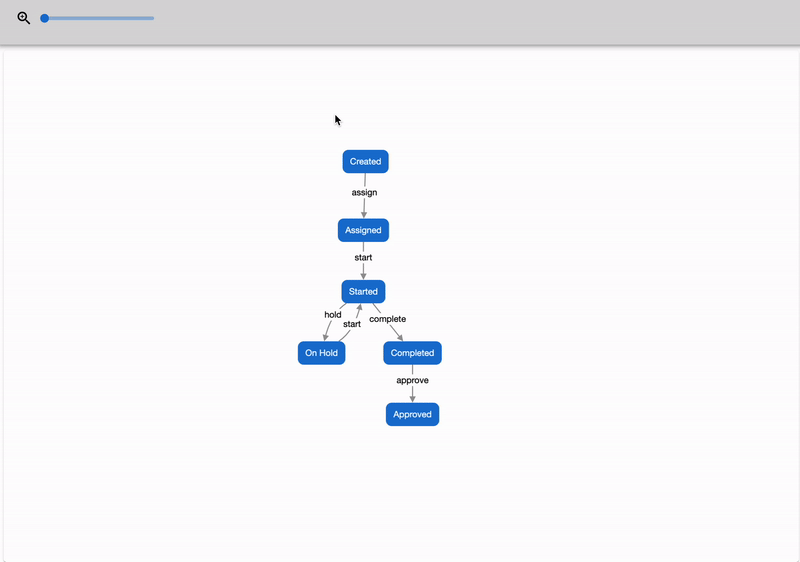
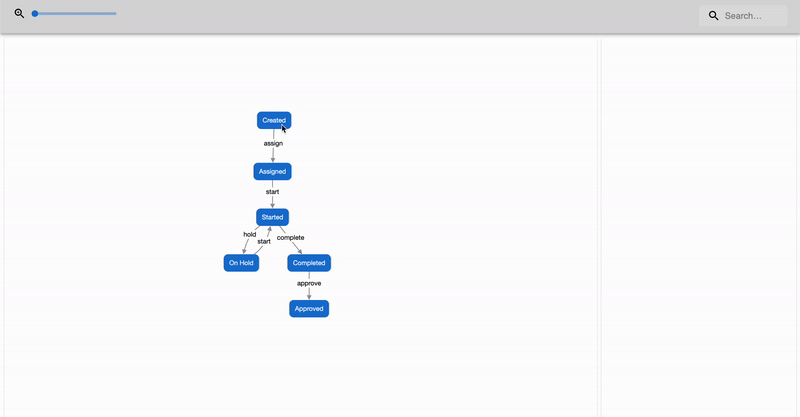

# Team 15.1 Assignment 2

### A summary of your decisions and the options you considered for your component(s)

Our team has been tasked with creating the UI/front end of the Graph Control screen, and our main objective is to display nodes/edges that are given to us in a presentable format. To achieve this, we evaluated several options for graph visualization libraries that would best fit our requirements.

Initially, we considered D3.js as one of the possible options for our component, as it is one of the most widely used visualization libraries with many features and capabilities. However, after careful consideration and evaluation of our requirements, we decided to use Cytoscape.js instead.

One of the main reasons we chose Cytoscape.js over D3.js is that Cytoscape.js provides a wide range of options for visualizing graphs, including customizable node and edge styles, zooming and panning, and animations. This would make it easier for us to create an interactive and visually appealing graph display. Additionally, Cytoscape.js is compatible with React, which is the framework we are using for our project. This would make it easier for us to integrate the library into our project and simplify our development process.

Another reason we chose Cytoscape.js over D3.js is its suitability for process mining. In process mining, graph visualization is a crucial aspect, and Cytoscape.js offers many features that are specifically tailored toward this domain. For example, Cytoscape.js offers various layout algorithms, which would enable us to lay out complex graphs in a way that is easy to understand and analyze. Moreover, Cytoscape.js offers support for edge bundling, which is particularly useful in process mining as it can help reduce visual clutter in graphs with many edges.

Finally, we found that D3.js requires much work to create any graph visualization. It has a steep learning curve and would require us to write a significant amount of custom code to achieve the required level of interactivity and customization. In contrast, Cytoscape.js provides a higher-level API that makes it easier to create interactive and customizable graph visualizations without requiring a significant amount of custom code.

In addition to selecting Cytoscape.js as our graph visualization library, we also implemented several features to enhance the user experience. These include a search feature, a magnification slider, and the ability to click on nodes to display additional information and select an intervention.

To implement the search feature, we created a search bar that allows users to search for nodes in the graph by their labels. When a user enters the search text, our code finds all nodes that match the search text and highlights them in the graph. We also implemented a magnification slider feature, which allows users to zoom in or out from the graph. This feature was added to allow users to view the graph at different levels of detail. Another feature we implemented was the ability to click on nodes to display additional information about the nodes and select an intervention. When a user clicks on a node, our code retrieves additional information about the node (currently dummy data) and displays it in a popup side drawer.

We discussed these components and their implementation with our project partners through our Figma presentation. We created a Figma prototype that outlined the layout and functionality of our component and presented it to our project partners for feedback and approval. They approved the layout and functionality of the components, and we were able to move forward with their implementation.

### Individual contributions explaining who did what.

- Geoff Yuen: Helped set up Cytoscape.js and implemented it as a React Component, worked on the Cytoscape.js layout algorithm, Implemented the search bar that highlights nodes that match the search text, the magnification slider that works on zooming in and out of the graph, and the layout of the Graph Control Screen.
- Angelina Choo Woon Chee: Set up the subteam repo and project, and helped set up Cytoscape.js within the project. Additionally, I implemented the side drawer that opens when the user clicks on a node, and can also be toggled close. Within the side drawer, I also implemented the number input field and the information boxes/display that can be seen when open.
- Hubert Gu: Worked on the Cytoscape.js layout algorithm and created demo data to display. Also set up the repository for deployment. 

### Details needed for TA to see and verify work

- How to get to the Graph Control Screen?
    - Click on the Map button on the navigation bar (next to the File button), then you will be presented with a graph displaying dummy nodes.
- How is testing done?

Features:

1. Search bar
    
    
    
    - The search bar sits on the right side of the Graph control screen. It should have a search icon and “Search…” as its input prompt.
    - How to use it?
        - Click on the search bar, type in the name of a node you want to search, and if there are any nodes that contain the search string as a substring, those nodes will be highlighted with a red overlay.
    - The node will stay highlighted until the search string that exists in the node is removed from the search bar.
2. Magnification slider 
    
    
    
    - the magnification slider sits on the left side (the far left side away from the search bar). The slider should have its initial value as the smallest zoom value.
    - How to use it?
        - Click anywhere along the sidebar drags the pointer to the mouse and the graph should zoom in accordingly.
    - Note: The zoom in Cytoscape currently focuses on the top left of the graph rather than the middle
3. Node side drawer
    
    
    
    - The node drawer opens from the right side of the screen.
    - How to use it?
        - Click on any node in the graph, and the node drawer will open out onto the screen.
        - It contains an input field for the speedup/speedown factor of the node, with a default value of 1. The user can change the value in this field by typing or using the step arrows. Clicking on the ‘x’ button beside the input field resets its value to 1.
        - Pressing either the ‘x’ button on the left side of the drawer header or the ‘Confirm Intervention’ button on the right side of the drawer header will close the drawer.
    - Note 1: At the moment, if the user changes the intervention value and clicks on ‘Confirm Intervention’, this change of state for the node will not persist as it should, but will be implemented before the next deliverable.
    - Note 2: The information contained in the two boxes below the input field currently contains static data but will be changed to display information specific to the clicked node.

### Citations

Jolly, P. (2018, November 17). *Big data - Graph Visualisations*. Medium. Retrieved February 23, 2023, from https://medium.com/@jollyp/big-data-graph-visualisations-75f341dc36ec
